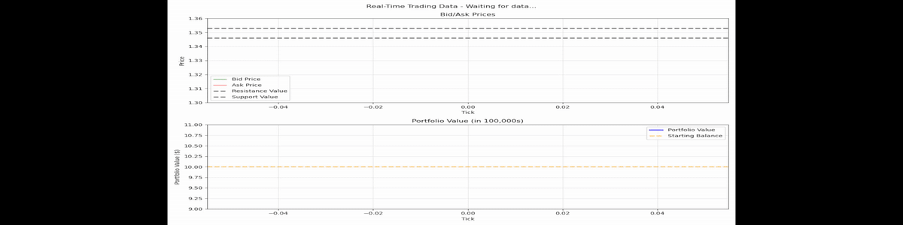
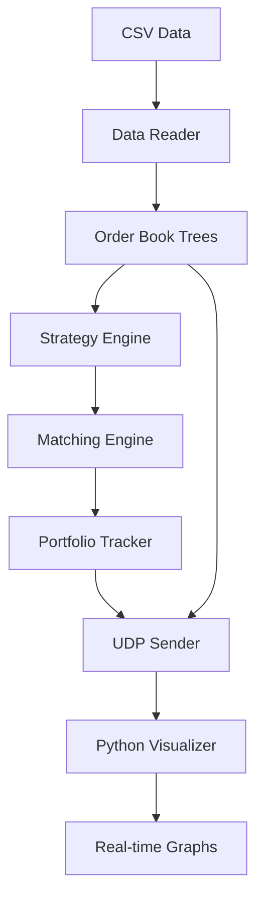

# High-Frequency Trading System

A high-performance C-based high-frequency trading system with live data visualization providing an environment for backtesting of custom trading strategies. Featuring red-black tree order books, hash table order matching, and real-time UDP-based graphing.

[]()
[]()
[]()

## Features

- **High-Performance**: Red-black tree order books with O(log n) operations
- **Real-Time Visualization**: Live bid/ask spread and portfolio tracking
- **Cross-Platform**: Windows and Linux support
- **Memory Efficient**: Limited tree sizes with automatic cleanup
- **UDP Communication**: Low-latency data streaming between C and Python
- **Advanced Matching**: Support for *market* and *limit* orders
- **Strategy Implementation**: Built-in support/resistance trading strategies with capability to develop other custom strategies



## Table of Contents

- [Quick Start](#quick-start)
- [Prerequisites](#prerequisites)
- [Usage](#usage)
- [Architecture](#architecture)
- [Core Components](#core-components)
- [Configuration](#configuration)
- [Benchmarks](#performance-benchmarks)
- [Troubleshooting](#troubleshooting)

## Quick Start

```bash
# 1. Clone the repository
git clone https://github.com/Thomas-Booth/HFT-Simulator-Project.git
cd trading-system

# 2. Install Python dependencies
pip install matplotlib

# 3. Compile the program
gcc -Wall -g -o trading_program.exe *.c -lws2_32 -lm

# 4. Start the real-time grapher
python graphing.py

# 5. Run the trading system
./trading_program.exe
```

## Prerequisites

- **Python**: 3.7+ with matplotlib support
- **C Compiler**: GCC, Clang, or MSVC
- **Networking**: Windows = ws2_32.lib, Linux = POSIX sockets

## Usage

### Basic Usage

1. **Start the visualization server:**
   ```bash
   python graphing.py
   ```
   *Wait for: "Successfully bound to port 8888"*

3. **Run the trading system:**
   ```bash
   ./trading_program.exe
   ```

4. **Watch live results:**
   - Real-time price charts will appear
   - Console shows trade executions
   - Portfolio value updates automatically
   - Graphs can be closed and reopened to continue from new data input


### CSV Data Format
Specify the name of the CSV file you are using in `main.c`

Your input CSV should follow this format:
```csv
date,time,bid_price,ask_price,bid_volume,ask_volume
2025-09-05,21:59:19.654,1.35045,1.35126,0.899999976158142,0.899999976158142
2025-09-05,21:59:27.765,1.35038,1.35134,0.899999976158142,5.40000009536743
```

## Architecture



## Core Components

| Component | Description | Data Structure |
|-----------|-------------|----------------|
| **Order Book** | Bid/Ask price levels | Red-Black Trees |
| **Order Matching** | Trade execution engine | Hash Table |
| **Portfolio** | Balance tracking | Struct |
| **Strategy** | Trading algorithms | Configurable |
| **Visualization** | Real-time charts | UDP + matplotlib |

### Performance Characteristics

- **Order insertion**: O(log n)
- **Best price lookup**: O(1)
- **Order matching**: O(1) hash lookup + O(log n) tree operations
- **Memory usage**: configurable by setting maximum tree and hash table sizes

## Configuration

### Strategy and Control Variables
Configure these values in `main.c`:
```c
// Money/volume configuration
#define STANDARD_LOT 100000   // Set a value for how much 1 volume is worth
#define STARTING_BALANCE 10   // Set a value for how much money to begin with (in 100,000s)

// If using the support/resistance strategy (default unless new strategy custom implemented)
#define SUPPORT 1.34600       // Set a level at which to place bid orders
#define RESISTANCE 1.35300    // Set a level at which to place ask orders

// Input file configuration
char filename[] = "GBPUSD_SHORTER_ticks.csv";   // Set the filename of the CSV file you're using

// User's initial balance of base "currency" (since this was tested using forex GBP/USD)
userAccount user = {0, STARTING_BALANCE}        // Set the balance of base and quote currencies 
```

### Memory Variables
Tree size for the bid/ask sides of the order book can be configured in `order_book.c`:
```c
#define MAX_TREE_SIZE 1000
```
Hash Table size for the user's orders can be configured in `matching.c`:
```c
#define SIZE 103
```

### Price Range Configuration for Graphing

Edit `graphing.py` to adjust chart ranges to match the values chosen in the above:
```python
#! UPDATE THESE HORIZONTAL LINES' VALUES IF USING SUPPORT/RESISTANCE STRATEGY
self.ax1.axhline(y=1.35300, ..., label='Resistance Value')    # Set y to match RESISTANCE in main.c
self.ax1.axhline(y=1.34600, ..., label='Support Value')       # Set y to match SUPPORT in main.c

#! UPDATE THE Y_LIMITS TO FIT THE GRAPH YOU WANT TO VIEW
self.ax1.set_ylim(1.30, 1.36)                                 # Change the y-limits for the graph to fit the view you want

#! UPDATE THE HORIZONTAL LINE SHOWING STARTING BALANCE IF CHANGED IN MAIN.C
self.ax2.axhline(y=10, color='orange', ..., label='Starting Balance')      # Set y to match STARTING_BALANCE in main.c

#! UPDATE Y_LIMIT VALUES TO FIT GRAPH YOU WANT TO VIEW          
self.ax2.set_ylim(9, 11)                                      # Set y-limits for the graph to fit the view you want
```

## Performance Benchmarks

### System Specifications
Benchmarks performed on:
- **CPU**: Intel i9-10850K @ 3.60GHz (10 cores)
- **RAM**: 32GB DDR4-3600
- **Storage**: NVMe SSD
- **OS**: Windows 11
- **Compiler**: GCC 15.2.0 with `-O3` optimization

### Throughput Performance

| Dataset Size | CSV Lines/Second | Memory Usage | Avg. Loop Time| Total Time |
|--------------|-------------|--------------|----------------|------------|
| 757K lines    | 22163      | 4.5 MB       | 44.5 µs        | 34.2 s     |


### Operation Breakdown

Performance profile for 757k line dataset:

| Operation | Total Time (ms) | Avg Time (μs) | Max Time (μs)| Calls  | Description |
|-----------|-----------------|---------------|--------------|--------|-------------|
| `system_initialisation`| 1.44 | 1441.1 | 1441.1 | 1 | Memory allocation |
| `CSV_reading`| 2901.55 | 20.2 | 65.8 | 1  | Data Read-In |
| `node_allocation`| 98.02 | 0.1 | 29.2 | 757083 | Memory allocation |
| `tree_insertions`| 157.76 | 0.2 | 50.3 | 757083 | Red-black tree operations |
| `strategy_execution`| 52.39 | 0.1 | 60.3 | 757083 | Trading algorithm |
| `order_matching`| 84.68 | 0.1 | 25.5 | 757083 | Hash table lookups |
| `price_lookups`| 45.21 | 0.1 | 19.8 | 757083 | Best price queries |
| `network_output`| 94.89 | 0.1 | 485.3 | 757083 | UDP data streaming |
| `cleanup`| 0.02 | 20.2 | 20.2 | 1 | Freeing memory |


### Memory Efficiency

- **Peak Memory**: <4.6MB for datasets up to 757K lines
- **Memory Growth**: Linear O(n) with tree size limits (max 1000 nodes per tree by default)

### Algorithmic Complexity

| Operation | Time Complexity | Space Complexity | Notes |
|-----------|----------------|------------------|-------|
| Order Book Insert | O(log n) | O(1) | Red-black tree insertion |
| Best Price Lookup | O(1) | O(1) | Direct tree root access |
| Order Matching | O(1) avg | O(n) | Hash table with collision handling (Linear Probing) |
| Tree Rebalancing | O(log n) | O(1) | Automatic red-black balancing |


### Running Benchmarks

#### Quick Benchmark
Benchmark functions used above can be found in `benchmark.c`. These can be used by first adding `#include "benchmark.h"` to `main.c`.
Then you are free to place benchmarking functions wherever you please, following a similar format to below:

```c
// ... inside near start of main()
perf_init("my_benchmark.log");


// Example timing benchmark
perf_start_timing("tree_insertions");
// TREE INSERTION LOGIC
insert_node(&bidTree, bid_node);
insert_node(&askTree, ask_node);
perf_end_timing("tree_insertions");


// Example Interim benchmarks
if (lines_processed % 10000 == 0) {
   // Example memory benchmark
   monitor_memory_usage("main_loop_progress");

   // Show interim throughput
   double elapsed_ms = get_time_ms() - loop_start_time;
   double throughput = lines_processed / (elapsed_ms / 1000.0);
   printf("Progress: %d lines, %.0f lines/sec\n", lines_processed, throughput);
}

// ... at end of main()

// Calculate final results
double total_time = get_time_ms() - loop_start_time;
double final_throughput = lines_processed / (total_time / 1000.0);
   
printf("\n=== PROCESSING SUMMARY ===\n");
printf("Total lines processed: %d\n", lines_processed);
printf("Total time: %.2f ms\n", total_time);
printf("Average throughput: %.0f lines/second\n", final_throughput);

perf_print_summary();
perf_cleanup();
```

```bash
# Compile with optimization
gcc -Wall -g -O3 -o trading_program.exe *.c -lws2_32 -lm

# Run as normal
./trading_program.exe

# Output: my_benchmark.log + console summary
```

## Troubleshooting

### Common Issues


<strong>"Failed to bind to port 8888"</strong>

Port already in use. Change the port:
```python
# In graphing.py
self.sock.bind(('127.0.0.1', 8889))  # Use different port
```

```c
// In main.c
server_addr.sin_port = htons(8889);  // Match Python port
```
